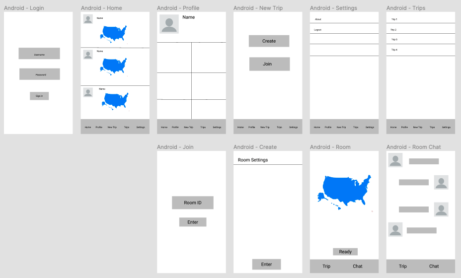
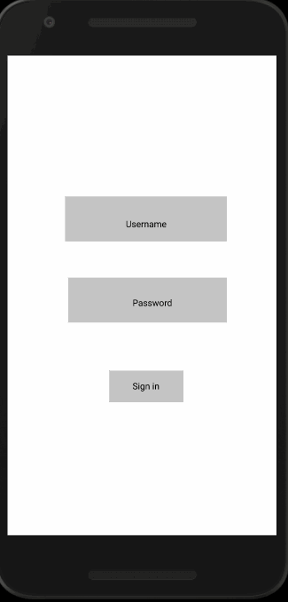

Original App Design Project - README
===

# Travelo

## Table of Contents
1. [Overview](#Overview)
1. [Product Spec](#Product-Spec)
1. [Wireframes](#Wireframes)
2. [Schema](#Schema)

## Overview
### Description
App that lets users build maps of their favorite places and share it.
### App Evaluation
- **Category:** Traveling/ Social Media
- **Mobile:** Mobile-first experience
- **Story:** A mix of traveling and social media. Users can share there experiences with other users while also using the app to plan new roadtrips with family and friends
- **Market:** General public / travelers
- **Habit:** Reliant on user experience, how easy it is to use, etc. Natural habit if they travel.
- **Scope:** Travel planner/assistant and social networking/feed

## Product Spec

### 1. User Stories (Required and Optional)

**Required Must-have Stories**

* Users can log in
* User can view feed to see other trips of other users
* Users can join a room with friends to plan a roadtrip
* User can create a room for friends
* User can click location on map and see recommended places to visit near the location

**Optional Nice-to-have Stories**

* DM other users
* Chat with other users in a room
* Follow other users

### 2. Screen Archetypes

* Login 
* Register - User signs up or logs into their account
   * Upon Download/Reopening of the application, the user is prompted to log in to gain access to their profile information to be properly matched with another person. 
* Discover Screen - Users can scroll through a list of trips, planned trips, and pictures of other users
* New Trip - Users can communicate with other users to plan a trip and post it to the feed
* Current Trips - Users can look at there planned trips. Can complete them.
* Profile Screen 
   * Allows user to upload a photo and fill in information that is interesting to them and others
* Settings Screen
   * Lets people change app preferences, and app notification settings.

### 3. Navigation

**Tab Navigation** (Tab to Screen)

* Home
* New Trip
* Current Trips
* Profile
* Setting

**Flow Navigation** (Screen to Screen)

* Forced Log-in -> Account creation if no log in is available
* New Trip -> Create or join a room with others to make a new roadtrip
* Profile -> Text field to be modified. 
* Settings -> Toggle settings

## Wireframes


### Digital Wireframes & Mockups

### Interactive Prototype


## Schema 

### Models
#### Post

   | Property      | Type     | Description |
   | ------------- | -------- | ------------|
   | objectId      | String   | unique id for the user post (default field) |
   | author        | Pointer to User| creator of post |
   | map           | Object   | JSON object that contains details of map user posted |
   | caption       | String   | image caption by author |
   | commentsCount | Number   | number of comments that has been posted to an image |
   | likesCount    | Number   | number of likes for the post |
   | createdAt     | DateTime | date when post is created (default field) |
   
   #### User

   | Property      | Type     | Description |
   | ------------- | -------- | ------------|
   | userId        | String   | unique id for the user (default field) |
   | username      | String   | unique username for the user (default field) |
   | password      | String   | password for the user (default field) |
   | profileImage  | File     | profile image of user |
   | createdAt     | DateTime | date when user is created (default field) |
   | inbox         | Object   | JSON object that contains details of the user's inbox |
   
   #### Room

   | Property      | Type     | Description |
   | ------------- | -------- | ------------|
   | objectId      | String | unique id for the room (default field) |
   | users         | Array  | Array of the users in the room |
   | owner         | Pointer to User | owner of room |
   | map           | Object   | JSON object that contains details of map user posted |
   | createdAt     | DateTime | date when user is created (default field) |
   | messages      | Array | JSON array of messages in the room |
### Networking
- [Add list of network requests by screen ]
- - Home Feed Screen
      - (Read/GET) Query all posts
         ```java
        ParseQuery<Post> query = ParseQuery.getQuery(Post.class);
        query.include(Post.KEY_USER);
        query.setLimit(LIMIT);
        query.addDescendingOrder(Post.KEY_CREATED_AT);
        query.findInBackground((posts, e) -> {
            if (e != null) {
                Log.e(TAG, "Couldn't get post", e);
                return;
            }
            for (Post post: posts) {
                Log.i(TAG, "Post: " + post.getDescription() + ", username: " + post.getUser().getUsername());
            }
            // Todo: Do something with post
        });
         ```
      - (Create/POST) Create a new like on a post
      - (Delete) Delete existing like
      - (Create/POST) Create a new comment on a post
      - (Delete) Delete existing comment
   - Room Screen
      - (Create/POST) Create a new post object
      - (Create/POST) Create a message to other users in the room
      - (Read/GET) Query all messages from users
   - Profile Screen
      - (Read/GET) Query logged in user object
       ```java
        ParseUser user = ParseUser.getCurrentUser();
        ```
      - (Update/PUT) Update user profile image
        ```java
        user.put("profileImage", parseFile);
        user.saveInBackground();
         ``` 
- [OPTIONAL: List endpoints if using existing API such as Yelp]
##### YELP API
- Base URL - [https://api.yelp.com/v3](https://api.yelp.com/v3)

   HTTP Verb | Endpoint | Description
   ----------|----------|------------
    `GET`    | /businesses/search | Search for businesses by keyword, category, location, price level, etc
    `GET`    | /businesses/{id} | Get rich business data, such as name, address, phone number, photos, Yelp rating, price levels and hours of operation
    
    ## Walkthrough
    
